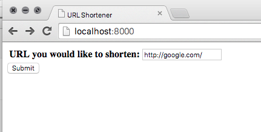
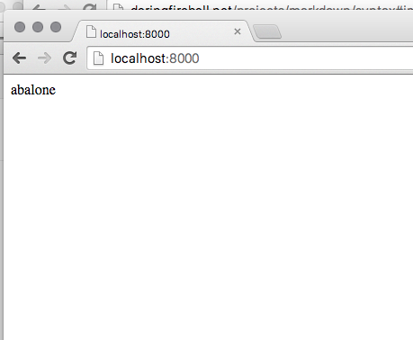

# URL Shortener
Toy project to create a URL shortener with django

# Description
THis url shortener shortens URLs, but attempts to create URLs that
are relatively friendly. If one types, for example, http://abalone.com,
abalone will be found in a pre-loaded dictionary, and the created
url will be http://<server-doman//abalone.

Creation view:

Response view:

## Running Instructions
To run, create a virtual environment and install dependencies in 
urlshortener/requirements.txt (i.e. pip install -r requirements.txt). 
sqlite3 must also be installed.

Then, cd into urlshortener and run ./load_words to load words into
sqlite3.

Finally, start the application by running ./manage runserver

When you enter an example shortened URL, its shortened form will be returned.
It will be resolved by typing http://localhost:8000/:short-url
